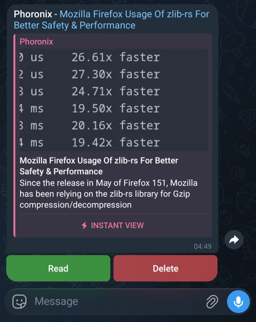

# miniflux-bot

[](https://github.com/Sad-Soul-Eater/miniflux-bot/actions/workflows/ci.yml)

A small Telegram bot that watches your [Miniflux](https://miniflux.app/) feeds and pushes each new unread entry to a Telegram chat. Every message comes with inline buttons so you can triage entries - mark them read/unread or delete them - straight from Telegram, with the action reflected back in Miniflux.



## Requirements

- A running Miniflux instance and an [API key](https://miniflux.app/docs/api.html#authentication)
- A Telegram bot token (from [@BotFather](https://t.me/BotFather)) and the target chat ID
- Docker (recommended), or Python **3.14+** to run from source

## Configuration

Configuration is read from environment variables (a local `.env` file is loaded automatically). Copy `.env.example` to `.env` and fill it in:

| Variable | Required | Default | Description |
| --- | --- | --- | --- |
| `MINIFLUX_URL` | yes | - | Base URL of your Miniflux instance |
| `MINIFLUX_API_KEY` | yes | - | Miniflux API key |
| `TELEGRAM_BOT_TOKEN` | yes | - | Bot token from BotFather |
| `TELEGRAM_CHAT_ID` | yes | - | Chat ID to deliver entries to |
| `MINIFLUX_STORE_BACKEND` | yes | - | State backend: `memory` or `sqlite` |
| `MINIFLUX_POLL_INTERVAL` | no | `60` | Seconds between Miniflux polls |
| `MINIFLUX_SQLITE_STORE_PATH` | only if `sqlite` | - | Directory for the SQLite file (`bot.sqlite` is created inside it) |

### State backends

- `memory` - an in-memory database. State is lost on restart, so the bot will re-deliver unread entries on the next run. Fine for testing.
- `sqlite` - a persistent database at `<MINIFLUX_SQLITE_STORE_PATH>/bot.sqlite`. Use this in production and mount the directory as a volume so progress survives restarts.

## Running

### With Docker (recommended)

Pre-built images are published to the GitHub Container Registry on each release:

```bash
docker run --rm --env-file .env \
  -e MINIFLUX_STORE_BACKEND=sqlite \
  -e MINIFLUX_SQLITE_STORE_PATH=/data \
  -v "$(pwd)/data:/data" \
  ghcr.io/sad-soul-eater/miniflux-bot:latest
```

Image tags track the release version - `:1.2.3`, `:1.2`, and `:latest`. Mount a volume at the path given by `MINIFLUX_SQLITE_STORE_PATH` to persist state. To build the image yourself instead of pulling it, replace the image name with a local `docker build -t miniflux-bot .`.

### From source with uv

```bash
uv sync
uv run python -m miniflux_bot
```

## Documentation

For how the bot works internally, the project layout, and how to develop, test, and release it, see [DEVELOPMENT.md](DEVELOPMENT.md).
